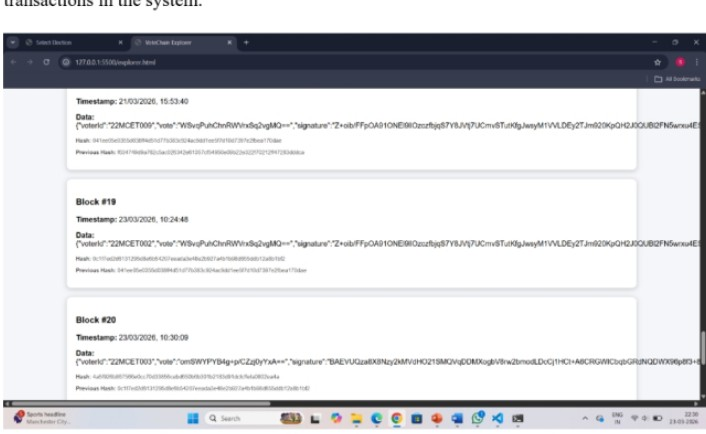
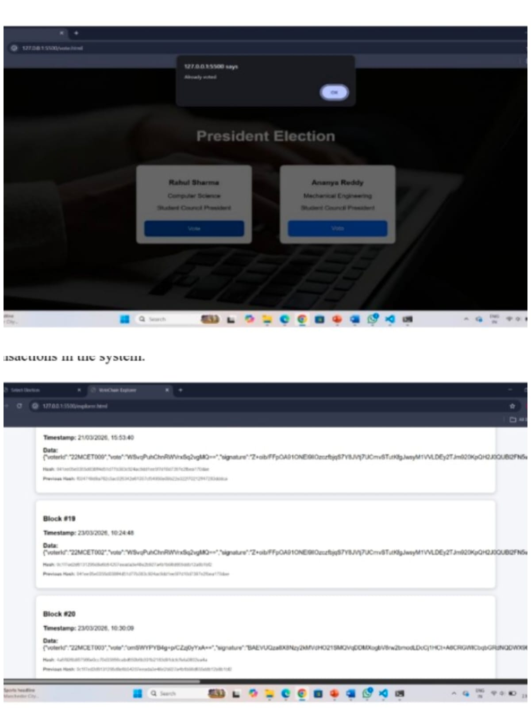
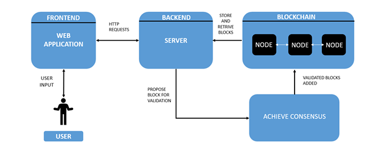
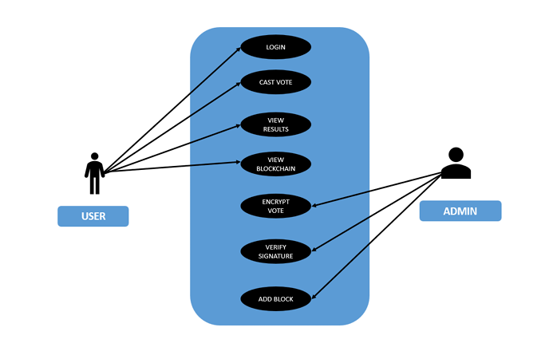
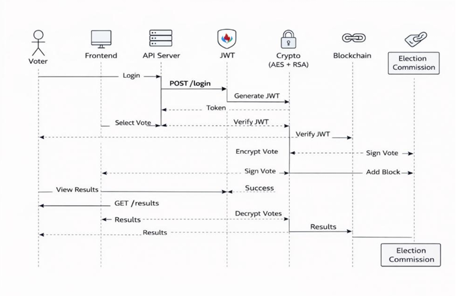
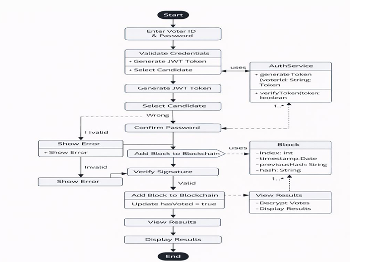
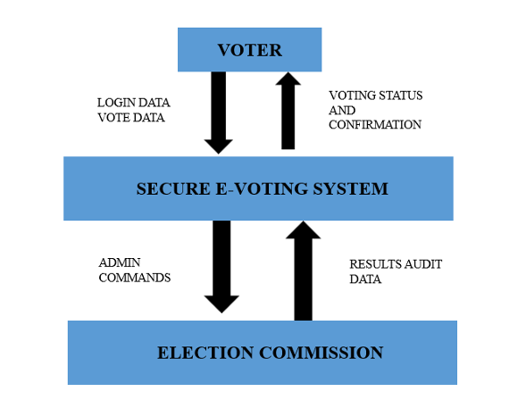
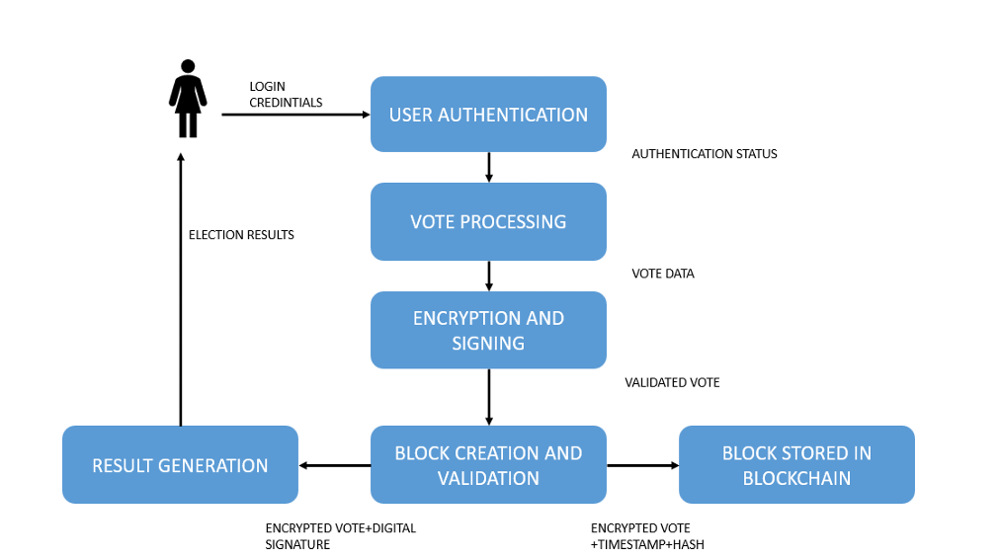

# Secure Blockchain-Based Online Voting System

## Overview

A secure blockchain-based electronic voting system designed to ensure transparency, vote integrity, and tamper-proof election management using blockchain and cryptographic security mechanisms.

## Features

- JWT-based voter authentication
- AES-256 encrypted voting
- RSA digital signatures
- Immutable blockchain ledger
- Real-time election result visualization
- Duplicate vote prevention

## Technologies Used

- Java
- React.js
- Blockchain
- JWT Authentication
- AES Encryption
- RSA Digital Signatures

## Screenshots

### Login Page

### Voting Page

### Blockchain Ledger

### Blockchain Explorer

### Election Results

## System Architecture

## Use Case Diagram

## Sequence Diagram

## Activity Diagram

## Data Flow Diagram Level 0

## Data Flow Diagram Level 1

